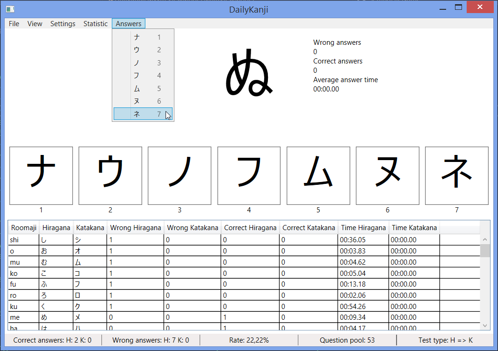
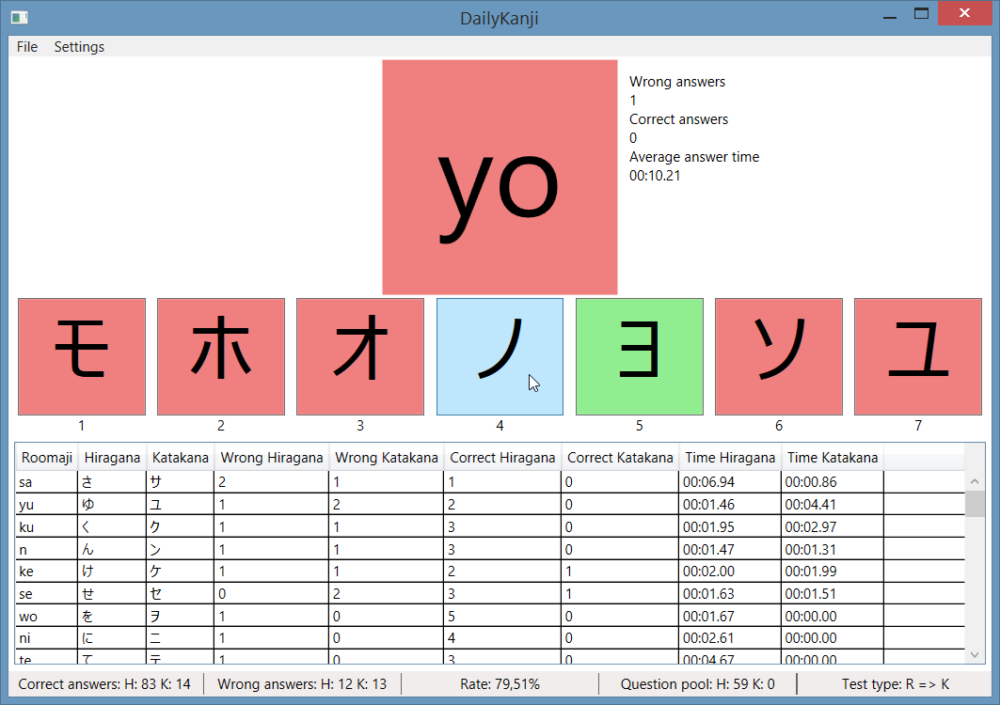

# Current state
in development

# Requirements for usage
* Windows 7 or newer (8, 8.1, 10)
* .Net Framework 4.7 or newer (4.7.1, 4.7.2)

# Current features
* 9 Test types
  * Hiragana or Katakana to Roomaji, Only Hiragana to Roomaji, Only Katakana to Roomaji
  * Roomaji to Hiragana or Katakana, Only Roomaji to Hiragana, Only Roomaji to Katakana
  * Hiragana to Katakana or Katakana to Hiragana, Only Hiragana to Katakana, Only Katakana to Hiragana
* Test can be answered via left mouse click, number key and menu
* Switch to previous test or next test
* Highlight wrong and correct answers, when answer was wrong
* Show hint of all possible answers, when answer was wrong (can be deactivated via menu)
* Running answer timer, when time is over the test is automatically answered wrong
* Count answer time (separates counter for Hiragana and Katakana)
* Can show only similar answers
* Changeable answer count (from two answers up to ten answers)
* Changeable error time (highlight when answer was wrong)
* Automatically load and save test statistics and settings
* Statistics can reset via menu

# Missing a feature or found a bug?
Open a issue ticket or make a pull request

# Pictures

# Requirements for debug, test and contributing
* Visual Studio 2017 Version 15.7 or newer to build
* C# 7.3

# Goals

#### Next (before 1.0 release)
* Change colour of visible timer on wrong answered to red
* Visible timer (progress-bar) can be deactivated via menu (timeout is deactivated too)
* Make maximum answer time and refresh interval for timer changeable via menu
* Add test type for all -> "Hiragana, Katakana or Roomaji to Hiragana, Katakana or Roomaji"
* Add more menu entry to reset individual things of the statistics
* Recalculate buttons (button width), when window is resized
* Add main counter for each test (negative/positive)
  * on right answers +1 on wrong answers - 1
  * use this counter to calculate count of same tests
  * use this count to order bottom test table
* Add four options for hints
  * "hints based on current ask type"
  * "hints always in Roomaji"
  * "hints always in Hiragana"
  * "hints always in Katakana"

#### Near future (before 1.0 release)
* Prevent double-click and multi-click on correct answers to avoid wrong next answer
  * Note: Prevent it direct inside the command handlers
* On similar answers, in some circumstance it is easy to direct find the correct answer, we need a prevention for this 
  * Maybe: Only the first character or last character must are the same on less then five answers
* Add similar list for each Hiragana and each Katakana character for option "Similar answers"
* Change test order so that all tests will be ask (based on ask counter)

#### Next versions (after 1.0 release)
* Move logic to separate library project in .Net Standard 2.0
* Add command line project in .Net Core 2.1 (usable under Windows, Linux, macOS)
* Export (XLSX, CSV, JSON, XML)
* Integrate Kanji tests

#### Ideas
* Make colours choose-able
* Import (XLSX, CSV, JSON, XML)
