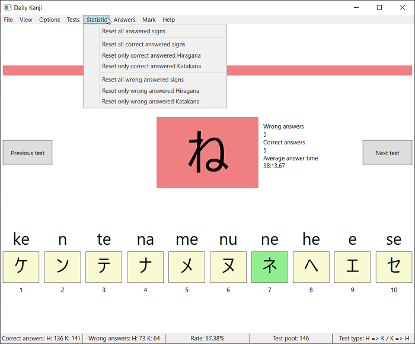
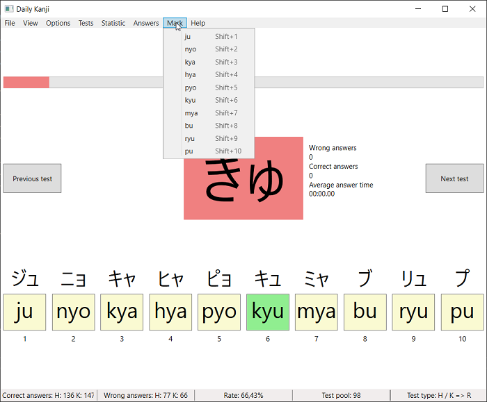

# Daily Kanji

## Requirements for usage
* Windows
  * Windows Vista SP2, 7 SP1, 8, 8.1 or 10
  * Windows Server 2008 SP2, 2008 R2 SP1, 2012, 2012 SP2, 2016 or 2019
* [.Net Framework 4.6](https://www.microsoft.com/en-US/download/details.aspx?id=48137)

## Current status and version
* Status: in (slow) development

| Type        | Version  | Git-Tag | Branch                                                               |
| ----------- | -------- | ------- | -------------------------------------------------------------------- |
| Release     | 0.6.1    | v0.6.1  | [master](https://github.com/TobiasSekan/DailyKanji/commits/master)   |
| Development | 0.6.9    | -       | [develop](https://github.com/TobiasSekan/DailyKanji/commits/develop) |

## Current features
* 10 Test types
  * Hiragana or Katakana to Roomaji, Only Hiragana to Roomaji, Only Katakana to Roomaji
  * Roomaji to Hiragana or Katakana, Only Roomaji to Hiragana, Only Roomaji to Katakana
  * Hiragana to Katakana or Katakana to Hiragana, Only Hiragana to Katakana, Only Katakana to Hiragana
  * All to All
* 6 Kana types
  * Gojuuon, Gojuuon with dakuten, Gojuuon with handakuten
  * Yooon, Yooon with dakuten, Yooon with handakuten
* Test can be answered via mouse left-click, number key, menu entry or gamepad buttons
* Switch to previous test or next test
* Running answer timer, when time is over the test is automatically answered wrong
* Mark possible wrong answers via mouse right-click, shift + number key or menu entry
* Highlight wrong and correct answers, when answer was wrong and/or correct
* Show hint of all possible answers, when answer was wrong (can be hide and change via menu)
* Wrong answered tests will be ask more often
* Can show only similar answers
* Changeable answer count, answer time, error highlight, error highlight time, ...
* Count right and wrong answers and answer times (separates counter for each Hiragana and Katakana)
* Separate window for statistics, statistics can individual reset via menu

## Pictures (under Windows 10) - Version 0.4.0

## Found a bug or missing a feature?
* Create a new [Bug report](https://github.com/TobiasSekan/DailyKanji/issues/new?template=bug_report.md)
* Create a new [Feature request](https://github.com/TobiasSekan/DailyKanji/issues/new?template=feature_request.md)

## Notes about support for Windows Vista, Window 8 and Windows Server 2008 SP2
At the very latest with the first release of .NET 5 (November 2020) the support for Windows Vista,
Window 8 and Windows Server 2008 SP2 will be end. Because we switch to .NET Standard 2.1 and .NET Core 3.0 .

## Whats next?
see [Roadmap](Documentation/Roadmap.md)

## Requirements for debug, test and contributing
* [Visual Studio 2019](https://visualstudio.microsoft.com/vs/), [Visual Studio Code](https://code.visualstudio.com/), [JetBrains Rider](https://www.jetbrains.com/rider/) or similar
* [.Net Framework 4.6](https://www.microsoft.com/en-US/download/details.aspx?id=48137) (include .Net Standard 1.3)
* C# 8.0

## Project structure
| Project         | Used framework     | Operating system             |
| --------------- | ------------------ | ---------------------------- |
| DailyKanji      | .Net Framework 4.6 | Windows                      |
| DailyKanjiLogic | .Net Standard 1.3  | Operating system independent |

## Used NuGet packages
| Package              | Version    | Reason                          |
| -------------------- | ---------- | ------------------------------- |
| Extended.Wpf.Toolkit | 3.5.0      | WPF elements (e.g. SpinUpDown)  |
| Newtonsoft.Json      | 12.0.2     | Load and Write JSON files       |
| SharpDX.DirectInput  | 4.2.0      | Gamepad support via DirectInput |
