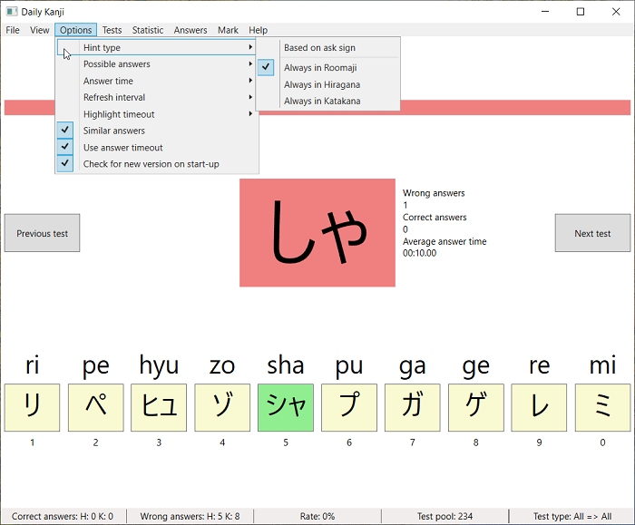

# Current state
* in development
* First version will released in December 2018 

# Requirements for usage
* Windows Vista SP2, Windows 7 SP1, Windows 8.0, Windows 8.1, Windows 10
* [.Net Framework 4.5.2](https://www.microsoft.com/en-us/download/details.aspx?id=42642)

# Current features
* 9 Test types
  * Hiragana or Katakana to Roomaji, Only Hiragana to Roomaji, Only Katakana to Roomaji
  * Roomaji to Hiragana or Katakana, Only Roomaji to Hiragana, Only Roomaji to Katakana
  * Hiragana to Katakana or Katakana to Hiragana, Only Hiragana to Katakana, Only Katakana to Hiragana
* Test can be answered via left mouse click, number key and menu
* Switch to previous test or next test
* Running answer timer, when time is over the test is automatically answered wrong
* Highlight wrong and correct answers, when answer was wrong 
* Show hint of all possible answers, when answer was wrong (can be hide and change via menu)
* Count answer times (separates counter for Hiragana and Katakana)
* Can show only similar answers
* Changeable answer count (from two answers up to ten answers)
* Changeable answer time (from one seconds up to fifteen seconds)
* Changeable error time (from one point five seconds to ten seconds)
* Statistics can individual reset via menu
* Automatically load and save test statistics and settings

# Pictures (under Windows 10)

# Missing a feature or found a bug?
Open a issue ticket or make a pull request

# Notes about support for Windows Vista and Window 8.0
The support for Windows Vista SP2 and Windows 8.0 will be maintained as long as possible.
But when I start with next major version of this project it is most likely, that I must drop this support.
Because I need to switch to a higher version of .Net Standard (1.6, 2.0 or higher).

# Goals

#### Next (before 1.0 alpha release)
* Add menu entry to deactivate timeout (hide visible timer too)
* Make refresh interval for timer changeable via menu
* Add test type for all -> "Hiragana, Katakana or Roomaji to Hiragana, Katakana or Roomaji"
* Add main counter for each test (negative/positive)
  * on right answers +1 on wrong answers - 1
  * use this counter to calculate count of same tests
  * use this count to order bottom test table
* Add menu underscores (for menu keyboard navigation)
* Add German language and language selector in menu
* Add message box with yes/no before delete statistics
* Add option to deactivate error highlight

#### Near future (between 1.0 alpha and 1.0 release)
* Recalculate buttons (button width), when window is resized
* Avoid rebuild of answer buttons and answer menu entries
* Prevent double-click and multi-click on correct answers to avoid wrong next answer
  * Note: Prevent it direct inside the command handlers
* On similar answers, in some circumstance it is easy to direct find the correct answer, we need a prevention for this 
  * Maybe: Only the first character or last character must are the same on less then five answers
* Add similar list for each Hiragana and each Katakana character for option "Similar answers"
* Change test order so that all tests will be ask (based on ask counter)
* Move more program parts to separate library project in .Net Standard 1.0

#### Next versions (after 1.0 release)
* Add command line project in .Net Core (usable under Windows, Linux, macOS)
* Start with integration of Kanji tests

#### Ideas
* Import (XLSX, CSV, JSON, XML)
* Export (XLSX, CSV, JSON, XML)
* Make colours choose-able
* Gamepad support
* Ribbon menu
* Investigate in WPF - FlowDocument (for integrated zooming features)
* Check for new version on startup
* Auto update program
* .Net Xamarin version for Andorid and iOS

# Requirements for debug, test and contributing
* [Visual Studio 2017](https://visualstudio.microsoft.com/de/downloads/), [Visual Studio Code](https://visualstudio.microsoft.com/de/downloads/), [JetBrains Rider](https://www.jetbrains.com/rider/) or similar
* [.Net Framework 4.5.2](https://www.microsoft.com/en-us/download/details.aspx?id=42642) (include .Net Standard 1.0)
* [Roslynator (Visual Studio Extension)](https://github.com/JosefPihrt/Roslynator) for code rules
* C# 7.3

# Project overview
| Project         | Used framework       | Operating system   |
| --------------- | -------------------- | ------------------ |
| DailyKanji      | .Net Framework 4.5.2 | Windows            |
| DailyKanjiLogic | .Net Standard 1.0    | *function library* |
