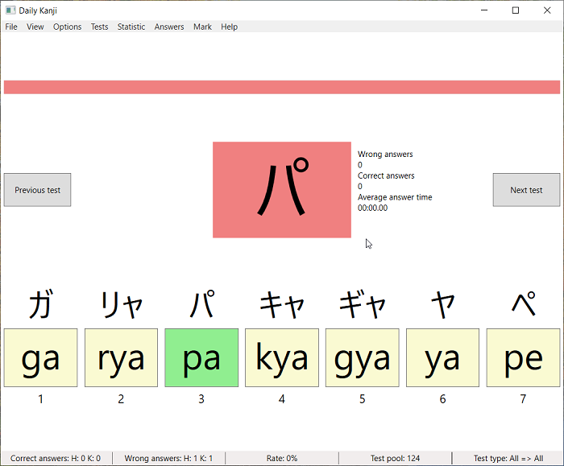

# Daily Kanji

## Requirements for usage
* Windows
  * Windows Vista SP2, 7 SP1, 8, 8.1 and 10
  * Windows Server 2008 SP2, 2008 R2 SP1, 2012, 2012 SP2, 2016 and 2019
* [.Net Framework 4.6](https://www.microsoft.com/en-US/download/details.aspx?id=48137)

## Current state
* in (slow) development

## Current features
* 9 Test types
  * Hiragana or Katakana to Roomaji, Only Hiragana to Roomaji, Only Katakana to Roomaji
  * Roomaji to Hiragana or Katakana, Only Roomaji to Hiragana, Only Roomaji to Katakana
  * Hiragana to Katakana or Katakana to Hiragana, Only Hiragana to Katakana, Only Katakana to Hiragana
* 6 Kana types
  * Gojuuon, Gojuuon with dakuten, Gojuuon with handakuten
  * Yooon, Yooon with dakuten, Yooon with handakuten
* Test can be answered via left mouse click, number key, menu entry or gamepad buttons
* Switch to previous test or next test
* Running answer timer, when time is over the test is automatically answered wrong
* Highlight wrong and correct answers, when answer was wrong 
* Show hint of all possible answers, when answer was wrong (can be hide and change via menu)
* Wrong answered tests will be ask more often
* Can show only similar answers
* Changeable answer count, answer time, error highlight, error highlight time, ...
* Count right and wrong answers and answer times (separates counter for each Hiragana and Katakana)
* Separate window for statistics, statistics can individual reset via menu

## Pictures (under Windows 10)

## Found a bug or missing a feature?
* Create a new [Bug report](https://github.com/TobiasSekan/DailyKanji/issues/new?template=bug_report.md)
* Create a new [Feature request](https://github.com/TobiasSekan/DailyKanji/issues/new?template=feature_request.md)

## Notes about support for Windows Vista and Window 8
The support for Windows Vista SP2 and Windows 8 will be maintained as long as possible.
But when I start with next major version of this project it is most likely, that I must drop this support.
Because I need to switch to a higher version of .Net Standard (2.0 or higher).

## Whats next?
see [Roadmap](Documentation/Roadmap.md)

## Requirements for debug, test and contributing
* [Visual Studio 2017](https://visualstudio.microsoft.com/en/downloads/), [Visual Studio 2019 Preview](https://visualstudio.microsoft.com/de/vs/preview/), [Visual Studio Code](https://visualstudio.microsoft.com/en/downloads/), [JetBrains Rider](https://www.jetbrains.com/rider/) or similar
* [.Net Framework 4.6](https://www.microsoft.com/en-US/download/details.aspx?id=48137) (include .Net Standard 1.3)
* C# 8.0

## Project structure
| Project         | Used framework     | Operating system             |
| --------------- | ------------------ | ---------------------------- |
| DailyKanji      | .Net Framework 4.6 | Windows                      |
| DailyKanjiLogic | .Net Standard 1.3  | Operating system independent |

## Used NuGet packages
| Package             | Reason                          |
| ------------------- | ------------------------------- |
| Newtonsoft.Json     | Load and Write JSON files       |
| SharpDX.DirectInput | Gamepad support via DirectInput |
